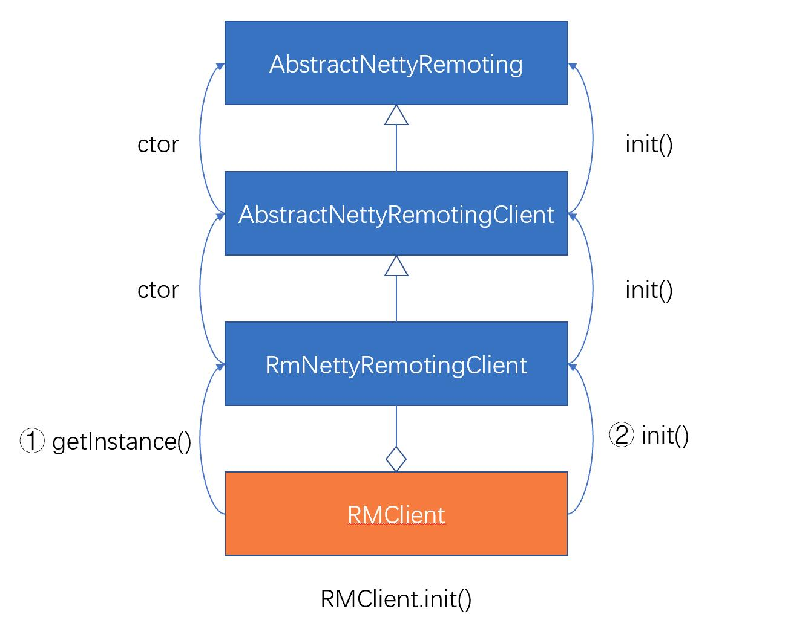

> “刚上手Seata不久，对其各个模块了解还不够深入？ <br>
想深入研究下Seata源码但却还未付诸实践？<br>
想探究下在集成Seata后，自己的应用在启动过程中“偷偷”干了些啥？<br>
如果你有上述问题，那么今天这篇文章，就是为你量身打造的~

## 盖个帽段
看过官网README的第一张图片的同学都应该清楚，Seata协调分布式事务的原理便在于通过其**协调器侧**的TC，来与**应用侧**的TM、RM进行各种通信与交互，来保证分布式事务中，多个事务参与者的数据一致性。那么Seata的协调器侧与应用侧之间，是如何建立连接并进行通信的呢？

没错，答案就是Netty，Netty作为一款高性能的RPC通信框架，保证了TC与RM之间的高效通信，本文探究的重点，在于**Seata的应用侧在启动过程中，如何通过一系列Seata关键模块之间的协作（如RPC、Config/Registry Center、LoadBalance等），来建立与协调器侧之间的通信**

## 给个限定
Seata作为一款中间件级的底层组件，是很谨慎地引入第三方框架具体实现的，感兴趣的同学可以深入了解下Seata的SPI机制，看看Seata是如何通过大量扩展点（Extension），来将组件的具体实现倒置出去，转而依赖抽象接口的，同时，Seata为了更好地融入微服务、云原生等流行架构所衍生出来的生态中，也对多款主流的微服务框架、注册中心、配置中心以及Java开发框架界“扛把子”——SpringBoot等做了主动集成，在保证微内核架构、松耦合、可扩展的同时，又可以很好地与各类组件“打成一片”，使得采用了各种技术栈的环境都可以比较方便地引入Seata。

本文为了贴近大家**刚引入Seata试用时**的场景，在以下介绍中，选择**应用侧**的限定条件如下：使用**File（文件）作为配置中心与注册中心**，并基于**SpringBoot**启动。

有了这个限定条件，接下来就让我们深入Seata，一探究竟吧。

## 从GlobalTransactionScanner说起
我们知道Seata提供了多个开发期注解，比如用于开启分布式事务的@GlobalTransactional、用于声明TCC两阶段服务的@TwoPhraseBusinessAction等，它们都是基于Spring AOP的拦截器（Interceptor）机制，对使用了注解的Bean方法分配对应的拦截器进行增强，来完成对应的处理逻辑。而Seata中GlobalTransactionScanner这个Spring Bean，就承载着为各个注解分配对应的拦截器的职责，从其Scanner的命名，我们也不难推断出，它是为了在Spring应用启动过程中，对与全局事务（GlobalTransactionScanner）相关的Bean进行扫描、处理的。

除此之外，应用侧RPC客户端（TMClient、RMClient）初始化、与TC建立连接的流程，也是在GlobalTransactionScanner#afterPropertiesSet()中发起的：
````java
    @Override
    public void afterPropertiesSet() {
        if (disableGlobalTransaction) {
            if (LOGGER.isInfoEnabled()) {
                LOGGER.info("Global transaction is disabled.");
            }
            return;
        }
        //在Bean属性初始化之后，执行TM、RM的初始化
        initClient();

    }
````

## RM & TM 的初始化流程
这里，我们以RMClient.init()为例说明，TMClient的初始化过程亦同理。
查看RMClient#init()的源码，我们发现，RMClient先构造了一个RmRpcClient，然后执行其init()方法。而RmRpcClient的构造器和init()方法，都会逐层调用父类的构造器与初始化逻辑。
````java
    public static void init(String applicationId, String transactionServiceGroup) {
        //① 首先从RmRpcClient类开始，依次调用父类的构造器
        RmRpcClient rmRpcClient = RmRpcClient.getInstance(applicationId, transactionServiceGroup);
        rmRpcClient.setResourceManager(DefaultResourceManager.get());
        rmRpcClient.setClientMessageListener(new RmMessageListener(DefaultRMHandler.get(), rmRpcClient));
        //② 然后从RmRpcClient类开始，依次调用父类的init()
        rmRpcClient.init();
    }
````
上述RMClient系列各类之间的关系以及调用构造器和init()初始化方法的过程如下图示意：
 <!--  -->
<!--  -->


那么为何要将RMClient设计成这样较为复杂的继承关系呢？其实是为了将各层的职责、边界划分清楚，使得各层可以专注于特定逻辑处理，实现更好的扩展性。（可参考Seata RPC模块重构PR的操刀者乘辉兄的文章[Seata-RPC重构之路]()）

而至于各个构造器以及init()方法中的具体逻辑，因为涉及的类、概念较多，这里我把能够表意的时序图画出来供大家查看和梳理，此图大家也可先跳过不看，在下面我们分析过几个重点类后，再回头来看，这些类是何时登场、相互之间又是如何组装的。


首先我们需要知道，应用侧与协调器侧的通信是借助Netty的Channel（网络通道）来完成的，因此关键在于Channel的创建。在Seata中，通过池化的方式（借助common-pool中的对象池）方式来创建、管理Channel。

这里我们有必要简要介绍下对象池的简单概念和其在Seata中的实现类：
* GenericKeydObjectPool<K, V>：KV泛型对象池，提供对所有对象的存取管理，而对象的创建，由其内部的工厂类来完成。
* KeyedPoolableObjectFactory<K, V>：KV泛型对象工厂，负责池化对象的创建，被对象池持有。

以下是Seata中Channel对象池的具体实现：
* 首先，被池化管理的对象就是Channel。
* 管理Channel的对象池：GenericKeydObjectPool
* 创建Channel的工厂：NettyPoolableFactory
* 工厂创建Channel时依据的Key:NettyPoolKey
* NettyPoolKey：主要包含两个信息：
    - **address**:创建Channel时，对应的Server地址
    - **message**:创建Channel时，向Server发送的RPC消息体

然后我们再看看Seata的几个核心类的主要职责：
* RpcClientBootstrap：RPC客户端核心引导类，持有Netty框架的Bootstrap对象，具备启停能力；具有根据连接地址来获取新Channel的能力，供Channel工厂类调用。
* NettyClientChannelManager:
  - 初始化并持有GenericKeydObjectPool对象池
  - 与对象池交互，对应用侧Channel进行管理（获取、释放、销毁、缓存等）
* AbstractRpcRemotingClient
  - 初始化并持有RpcClientBootstrap
  - 抽象化应用侧Client（RM/TM）取得各自Channel对应的NettyPoolKey的能力，供NettyClientChannelManager调用
  - 初始化NettyPoolableFactory

了解上述概念后，我们可以把Seata中创建Channel的过程简化如下：


  看到这里，大家可以回过头再看看上面的**RMClient的初始化序列图**，应该会对RMClient中各类的职责、关系，以及整个初始化过程的意图有一个比较清晰的理解了。
  
  那么，RMClient是何时与Server建立连接的呢？

  在参考上面序列图和阅读init()方法源码的过程中，大家会发现，很多init()方法都设定了一些定时任务，而Seata应用侧与协调器的重连（连接）机制，就是通过定时任务的执行来实现的：

````java
    /**
     * Class io.seata.core.rpc.netty.AbstractRpcRemotingClient
     */
    public void init() {
        clientBootstrap.setChannelHandlers(new ClientHandler());
        clientBootstrap.start();
        //设置定时器，定时重连TC Server
        timerExecutor.scheduleAtFixedRate(new Runnable() {
            @Override
            public void run() {
                clientChannelManager.reconnect(getTransactionServiceGroup());
            }
        }, SCHEDULE_INTERVAL_MILLS, SCHEDULE_INTERVAL_MILLS, TimeUnit.SECONDS);
        //以下代码略
    }
````

这里我们通过跟踪一次reconnect的执行，看看上面探究的几个类之间是如何协作，完成RMClient与TC的连接的（实际上首次连接可能发生在registerResource的过程中，但流程一致）


这个图中，大家可以重点关注这几个点：
* NettyClientChannelManager执行具体AbstractRpcRemotingClient中，获取NettyPoolKey的回调函数（getPoolKeyFunction()）：应用侧的不同Client（RMClient与TMClient），在创建Channel时使用的Key不同，使**两者在重连TC Server时，发送的注册消息不同**，这也是由两者在Seata中扮演的角色不同而决定的：
  - TMClient：扮演事务管理器角色，创建Channel时，仅向TC发送TM注册请求（RegisterTMRequest）即可。
  - RMClient：扮演资源管理器角色，需要管理应用侧所有的事务资源，因此在创建Channel时，需要在发送RM注册请求（RegesterRMRequest）前，获取应用侧所有事务资源（Resource）信息，注册至TC Server。
* 在Channel对象工厂NettyPoolableFactory的makeObject（制造Channel）方法中，使用NettyPoolKey中的两项信息，完成了两项任务：
    - 使用NettyPoolKey的address创建新的Channel。
    - 使用NettyPoolKey的message以及新的Channel向TC Server发送注册请求，这就是Client向TC Server的连接（首次执行）或重连（非首次，由定时任务驱动执行）请求。

  以上流程，就是Seata应用侧的初始化及其与TC Server协调器侧连接的全过程，更深层次的细节，大家可以来顺着本文梳理出的脉络，详细阅读下源码，相信大家一定会有更深层次的理解和全新的收获！

> 后记：受限于篇幅并保持一篇源码分析文章较为合理的信息量，本文最初所限定的**使用文件作为配置和注册中心**的前提、以及配置中心、注册中心这两个模块，在应用侧初始化并连接TC Server过程中的作用于配合，本文并没有展开讲解。<br>
不用担心，在下次源码剖析中，我会为大家分析，在RMClient/TM Client与TC Server建立连接之前，Seata应用侧是**如何完成服务发现**，并**从配置中心中获取各种配置**的，我们下次再见！

