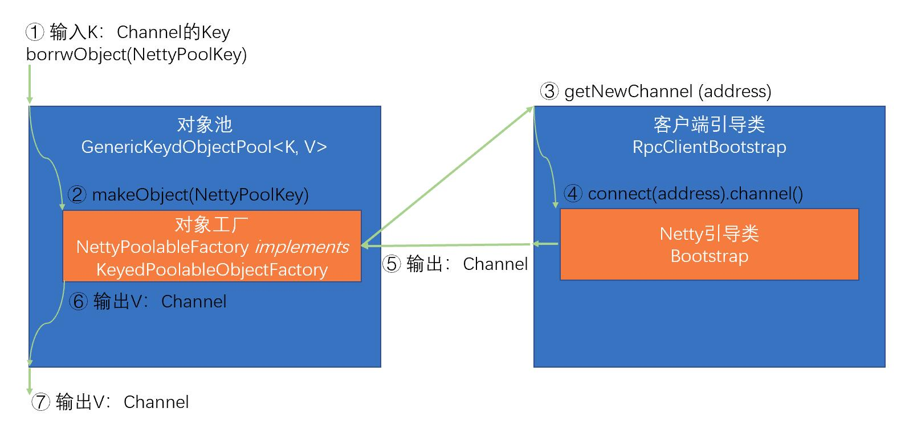

> “刚上手Seata不久，对其各个模块了解还不够深入？ <br>
想深入研究下Seata源码但却还未付诸实践？<br>
想探究下在集成Seata后，自己的应用在启动过程中“偷偷”干了些啥？<br>
如果你有上述问题，那么今天这篇文章，就是为你量身打造的~

## 盖个帽段
看过官网README的第一张图片的同学都应该清楚，Seata协调分布式事务的原理便在于通过其**协调器侧**的TC，来与**应用侧**的TM、RM进行各种通信与交互，来保证分布式事务中，多个事务参与者的数据一致性。那么Seata的协调器侧与应用侧之间，是如何建立连接并进行通信的呢？

没错，答案就是Netty，Netty作为一款高性能的RPC通信框架，保证了TC与RM之间的高效通信，关于Netty的详细介绍，大家可以移步至[!Netty介绍](http://sd)进行学习，而本文今天探究的重点，在于**应用侧在启动过程中，如何通过一系列Seata关键模块之间的协作（如RPC、Config/Registry Center、LoadBalance等），来建立与协调器侧之间的通信**

## 给个限定
Seata作为一款中间件级的底层组件，是很谨慎地引入第三方框架具体实现的，感兴趣的同学可以深入了解下Seata的SPI机制，（可参考[Seata SPI核心原理与设计](http://)）看看Seata是如何通过大量扩展点（Extension），来将组件的具体实现倒置出去，转而依赖抽象接口的，同时，Seata为了更好地融入微服务、云原生等流行架构所衍生出来的生态中，也对多款主流的微服务框架、注册中心、配置中心以及Java开发框架界“扛把子”——SpringBoot等做了主动集成，在保证微内核架构、松耦合、可扩展的同时，又可以很好地与各类组件“打成一片”，使得采用了各种技术栈的环境都可以比较方便地引入Seata。

本文为了贴近大家**刚引入Seata试用时**的场景，在以下介绍中，选择**应用侧**的限定条件如下：使用**File（文件）作为配置中心与注册中心**，并基于**SpringBoot**启动。

有了这个限定条件，接下来就让我们深入Seata，一探究竟吧。

## 从GlobalTransactionScanner说起
我们知道Seata提供了多个开发期注解，比如用于开启分布式事务的@GlobalTransactional、用于声明TCC两阶段服务的@TwoPhraseBusinessAction等，它们都是基于Spring AOP的拦截器（Interceptor）机制，对使用了注解的Bean方法分配对应的拦截器进行增强，来完成对应的处理逻辑。而Seata中GlobalTransactionScanner这个Spring Bean，就承载着为各个注解分配对应的拦截器的职责，从其Scanner的命名，我们也不难推断出，它是为了在Spring应用启动过程中，对与全局事务（GlobalTransactionScanner）相关的Bean进行扫描、处理的。

除此之外，应用侧RPC客户端（TMClient、RMClient）初始化、与TC建立连接的流程，也是在GlobalTransactionScanner#afterPropertiesSet()中发起的：
````java
    @Override
    public void afterPropertiesSet() {
        if (disableGlobalTransaction) {
            if (LOGGER.isInfoEnabled()) {
                LOGGER.info("Global transaction is disabled.");
            }
            return;
        }
        //在Bean属性初始化之后，执行TM、RM的初始化
        initClient();

    }
````

## <code>重点:</code>多模块交替协作的TM & RM 初始化
这里，我们以RMClient.init()为例说明，TMClient的初始化过程亦同理。
### 首先登场的是RPC模块
查看RMClient#init()的源码，我们发现，RMClient先构造了一个RmRpcClient，然后执行其init()方法。而RmRpcClient的构造器和init()方法，都会逐层调用父类的构造器与初始化逻辑。
````java
    public static void init(String applicationId, String transactionServiceGroup) {
        //① 首先从RmRpcClient类开始，依次调用父类的构造器
        RmRpcClient rmRpcClient = RmRpcClient.getInstance(applicationId, transactionServiceGroup);
        rmRpcClient.setResourceManager(DefaultResourceManager.get());
        rmRpcClient.setClientMessageListener(new RmMessageListener(DefaultRMHandler.get(), rmRpcClient));
        //② 然后从RmRpcClient类开始，依次调用父类的init()
        rmRpcClient.init();
    }
````
上述RMClient系列各类之间的关系、逐层调用构造器和init()初始化方法的过程，在下图中进行示意：


那么为何要将RMClient设计成这样较为复杂的继承关系呢？其实是为了将各层的职责边界划分清楚，使得各层更专注于特定逻辑处理，并赋予Seata RPC Client更好的扩展性（具体可参考Seata RPC模块重构PR的操刀者乘辉兄的文章[Seata-RPC重构之路]()）

而至于各个构造器以及init()方法中的具体逻辑，在第一次阅读时，大家可能会感觉信息量稍大，这里我把能够表意的时序图画出来供大家梳理，此图也可先跳过不看，在下面讲到几个较重要的类时，再回头来看它们是何时出现并如何与Seata交互的。


首先我们需要知道，应用侧与协调器侧的通信是借助Netty的Channel（信道）来完成的，因此应用侧建立通信的核心在于Channel的创建。在Seata中，我们通过对象池的方式来创建Channel。

这里我们先对对象池的简单概念和在Seata中的实现类进行进行介绍：
* GenericKeydObjectPool<K, V>：泛型对象池，核心逻辑为根据入参K来创造类型为V的对象，而对象创建的过程，则委托给其内部持有的抽象工厂。KeyedPoolableObjectFactory<K, V>。
* NettyPoolableFactory，上述抽象工厂的实现，根据NettyPoolKey，来创建Channel。
* NettyPoolKey：创建Channel的Key，包含两个信息：
    - **address**:Channel对应的Server地址
    - **message**:向Server发送的RPC消息体

了解了对象池这几个主要概念后，我们其实可以把创建Channel的逻辑简化如下：


然后我们再看看Seata的几个核心类的主要职责：
* RpcClientBootstrap：RPC客户端核心引导类，具备启停能力
* NettyClientChannelManager:
  - 初始化并持有GenericKeydObjectPool对象池
  - 与对象池交互，对应用侧Channel进行管理（获取、释放、销毁、缓存等）
* AbstractRpcRemotingClient
  - 初始化并持有RpcClientBootstrap
  - 抽象化Client（RM/TM）获取其对应NettyPoolKey的能力，并提供给NettyClientChannelManager
  - 初始化NettyPoolableFactory

  看到这里，大家可以回过头再看看上面的**RMClient的初始化序列图**，对RMClient的初始化、各类之间的组装应该会有一个大致清晰的理解了。
  
  那么，RMClient是何时与Server建立连接的呢？

  在上面序列图和init()方法源码阅读过程中，大家可以发现，很多init()方法都定义了几个线程池用于设定定时任务，Seata应用侧与协调器的连接/重连机制，就是通过定时任务实现的：

````java
    /**
     * Class io.seata.core.rpc.netty.AbstractRpcRemotingClient
     */
    public void init() {
        clientBootstrap.setChannelHandlers(new ClientHandler());
        clientBootstrap.start();
        //设置定时器，定时重连TC Server
        timerExecutor.scheduleAtFixedRate(new Runnable() {
            @Override
            public void run() {
                clientChannelManager.reconnect(getTransactionServiceGroup());
            }
        }, SCHEDULE_INTERVAL_MILLS, SCHEDULE_INTERVAL_MILLS, TimeUnit.SECONDS);
        //以下代码略
    }
````

这里我们以第一次执行reconnect的时机，看看上面探究的几个类之间是如何协作，完成RMClient与TC的连接的（实际上首次连接可能发生在registerResource的过程中，但流程一致）


这个图中，大家可以重点关注这几个点：
 AbstractRpcRemotingClient具备执行具体Client获取NettyPoolKey回调的能力，此能力由RMRpcClient/TMRpcClient具体实现，此Key中具有两个主要信息：要链接的Server 地址，以及重连时要发送的RPC消息体
 构造对象池GenericKeyedObjectPool时传入的NettyPoolableFactory，由在通过对象池获取Channel对象时发挥作用：根据NettyPoolKey来从工厂中构造一个对象（用到了抽象工厂模式）
RpcClientBootstrap是对Netty原生Bootstrap对象的封装，负责于Netty直接交互，获取新的Channel（同时还有启动。停止的能力）
在NettyPoolableFactory的makeObject方法中，不仅获取到了新的Channel，还直接使用此Channel发送了重连消息（分別用到了NettyPoolKey的address和message）
  以上流程，就是Seata客户端初始化时如何与TC Server连接的全过程，具体的细节，大家可以来顺着本文的梳理的脉络和重点详细阅读下源码，相信大家会有更深入的理解和全新的收获！

> 后记：有没有同学好奇，在最后RMClient与TC Server建立连接时，Seata时如何完成服务发现，并从配置中心中获取各种数据的呢？<br>
别急，在下次分享中，我们以Seata应用侧启动过程中的服务发现与获取配置为探究点，为大家剖析Seata的注册与配置中心模块！


