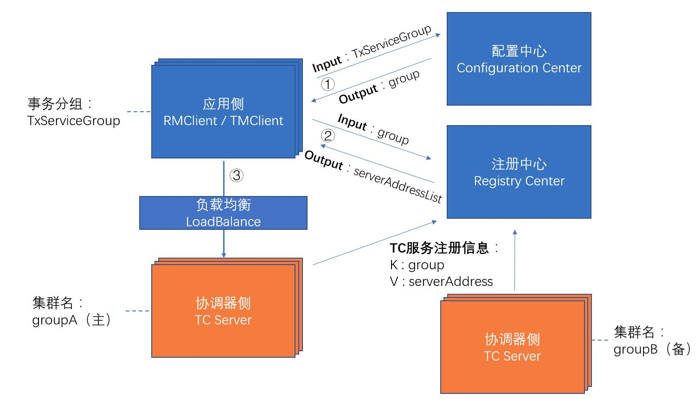

> “刚上手Seata不久，对其各个模块了解还不够深入？ <br>
想深入研究下Seata源码但却还未付诸实践？<br>
想探究下在集成Seata后，自己的应用在启动过程中“偷偷”干了些啥？<br>
如果你有上述问题，那么今天这篇文章，就是为你量身打造的~

## 前言
在Seata的应用侧（RM、TM）启动过程中，首先要做的就是与协调器侧（TC）建立通信，这是Seata能够协调分布式事务的必要前提，那么Seata在完成应用侧初始化以及与TC建立连接时，是**如何找到TC事务协调器的集群地址**的，又是**如何获取启动过程中的多种配置项**的呢？这就是本文探究的重点。

## 给个限定
Seata作为一款中间件级的底层组件，是很谨慎地引入第三方框架具体实现的，感兴趣的同学可以深入了解下Seata的SPI机制，看看Seata是如何通过大量扩展点（Extension），来将组件的具体实现倒置出去，转而依赖抽象接口的，同时，Seata为了更好地融入微服务、云原生等流行架构所衍生出来的生态中，也基于SPI机制对多款主流的微服务框架、注册中心、配置中心以及Java开发框架界“扛把子”——SpringBoot等做了主动集成，在保证微内核架构、松耦合、可扩展的同时，又可以很好地与各类组件“打成一片”，使得采用了各种技术栈的环境都可以比较方便地引入Seata。

本文为了贴近大家**刚引入Seata试用时**的场景，在以下介绍中，选择**应用侧**的限定条件如下：使用**File（文件）作为配置中心与注册中心**，并基于**SpringBoot**启动。

有了这个限定条件，接下来就让我们深入Seata，一探究竟吧。

## 多模块交替协作的RM/TM初始化过程
在[ Seata客户端启动过程剖析（一）](http://booogu.top/2021/02/28/seata-client-start-analysis-01/)中，我们主要分析了Seata应用侧TM与RM的初始化、以及应用侧如何创建Netty Channel并向TC Server发送注册请求的过程。除此之外，在RM初始化过程中，Seata的其他多个模块（注册中心、配置中心、负载均衡）也都纷纷登场，相互协作，共同完成了连接TC Server的过程。

比如当执行Client重连TC Server的方法：NettyClientChannelManager.Channreconnect()方法时，首先就是根据当前的**事务分组**获取可用的Server地址列表：
```java
    /**
     * NettyClientChannelManager.reconnect()
     * Reconnect to remote server of current transaction service group.
     *
     * @param transactionServiceGroup transaction service group
     */
    void reconnect(String transactionServiceGroup) {
        List<String> availList = null;
        try {
            //从注册中心中获取可用的TC Server地址
            availList = getAvailServerList(transactionServiceGroup);
        } catch (Exception e) {
            LOGGER.error("Failed to get available servers: {}", e.getMessage(), e);
            return;
        }
        //以下代码略
    }
```

关于事务分组的详细概念介绍，大家可以参考官方文档[事务分组介绍](https://seata.io/zh-cn/docs/user/txgroup/transaction-group.html)。这里简单介绍一下:
- 每个Seata应用侧的RM、TM，都具有一个事务分组名
- 每个Seata协调器侧的TC，都具有一个集群名和地址
应用侧连接协调器侧时，经历如下两步：
- 通过事务分组的名称，从配置中获取到该应用侧对应的TC集群名
- 通过集群名称，可以从注册中心中获取TC集群的地址列表
图示如下：


### 从**注册中心**获取TC Server集群地址
我们继续探究getAvailServerList方法：
```java
    private List<String> getAvailServerList(String transactionServiceGroup) throws Exception {
        //① 使用注册中心工厂，获取注册中心实例
        //② 调用注册中心的查找方法lookUp()，根据事务分组名称获取TC集群中可用Server的地址列表
        List<InetSocketAddress> availInetSocketAddressList = RegistryFactory.getInstance()
                                                                            .lookup(transactionServiceGroup);
        if (CollectionUtils.isEmpty(availInetSocketAddressList)) {
            return Collections.emptyList();
        }

        return availInetSocketAddressList.stream()
                                         .map(NetUtil::toStringAddress)
                                         .collect(Collectors.toList());
    }
```
#### 用哪个注册中心？**Seata配置文件**给出答案
上面已提到，Seata支持多种注册中心的实现，那么，Seata首先需要从一个地方先获取到“注册中心的类型”这个信息。

从哪里获取呢？Seata设计了一个“配置文件”用于存放其框架内所用组件的一些基本信息，我更愿意称这个配置文件为 **『元配置文件』**，这是因为它包含的信息，其实是“配置的配置”，也即“元”的概念，大家可以对比数据库表中的信息，和数据库表本身结构的信息（表数据和表元数据）来理解。

我们可以把注册中心、配置中心中的信息，都看做是**配置信息本身**，而这些**配置信息的配置**是什么？这些信息，就包含在Seata的元配置文件中。实际上，『元配置文件』中只包含**两类信息**：
- 一是注册中心的类型：registry.type，以及该类型注册中心的一些基本信息，比如当注册中心类型为文件时，元配置文件中存放了文件的名字信息；当注册中心类型是Nacos时，元配置文件中则存放着Nacos的地址、命名空间、集群名等信息
- 二是配置中心的类型：config.type，以及该类型配置中心的一些基本信息，比如当配置中心为文件时，元配置文件中存放了文件的名字信息；当注册中心类型为Consul时，元配置文件中存放了Consul的地址信息

Seata的元配置文件支持Yaml、Properties等多种格式，而且可以集成到SpringBoot的application.yaml文件中（使用SpringBootStarte即可），方便与SpringBoot集成。

Seata中默认将元配置文件定为registry.conf，在本例中，我们采用文件作为注册与配置中心时，registry.conf中的内容可以设置如下：
```conf
registry {
  # file 、nacos 、eureka、redis、zk、consul、etcd3、sofa
  type = "file"
  file {
    name = "file.conf"
  }
}

config {
  # file、nacos 、apollo、zk、consul、etcd3
  type = "file"
  file {
    name = "file.conf"
  }
}
```
再回到我们的主流程，现在我们要从元配置文件中，获取注册中心的类型，这部分主要源码如下：
```java
    //在getInstance()中，调用buildRegistryService，构建具体的RegistryService实例
    public static RegistryService getInstance() {
        if (instance == null) {
            synchronized (RegistryFactory.class) {
                if (instance == null) {
                    instance = buildRegistryService();
                }
            }
        }
        return instance;
    }

    private static RegistryService buildRegistryService() {
        RegistryType registryType;
        //获取注册中心类型
        String registryTypeName = ConfigurationFactory.CURRENT_FILE_INSTANCE.getConfig(
            ConfigurationKeys.FILE_ROOT_REGISTRY + ConfigurationKeys.FILE_CONFIG_SPLIT_CHAR
                + ConfigurationKeys.FILE_ROOT_TYPE);
        try {
            registryType = RegistryType.getType(registryTypeName);
        } catch (Exception exx) {
            throw new NotSupportYetException("not support registry type: " + registryTypeName);
        }
        if (RegistryType.File == registryType) {
            return FileRegistryServiceImpl.getInstance();
        } else {
            //根据注册中心类型，使用SPI的方式加载注册中心的实例
            return EnhancedServiceLoader.load(RegistryProvider.class, Objects.requireNonNull(registryType).name()).provide();
        }
    }
```
可以看到，注册中心的类型，是从ConfigurationFactory.CURRENT_FILE_INSTANCE中获取的，而这个CURRENT_FILE_INSTANCE，就是我们所说的，Seata框架中持有的**元配置文件实例**


Seata通过内置的元配置文件，帮助大家在刚接入Seata时，采用默认的文件配置、文件注册的方式，实现了对Seata-Server的直连，而且与SpringBoot进行了集成，了解这部分之后，其实是大家对Seata进行扩展的一个基础。